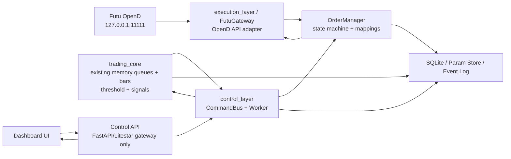
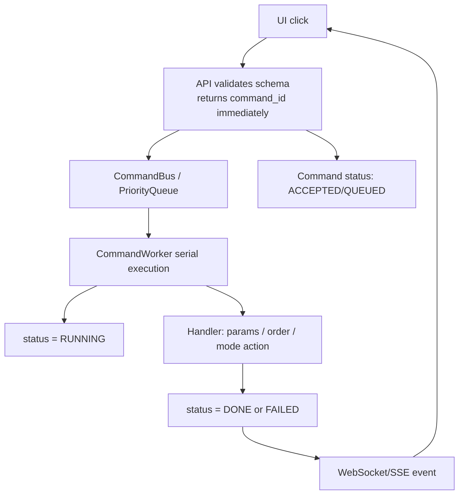
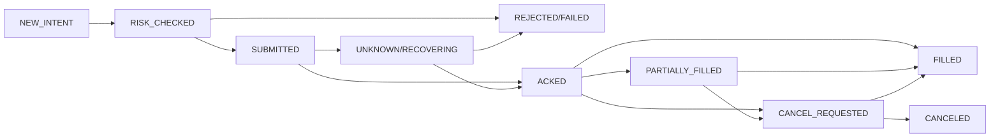

# OpenD 交易执行与控制监控层重构需求文档

面向 Codex 的实现说明：保留交易计算层，重写 OpenD 执行层与控制监控层。

## 1. 文档目标

本需求文档用于指导 Codex 或工程实现者重构现有交易系统。当前系统中的行情内存队列、bar 聚合、threshold 计算和 signal 生成逻辑可以保留；需要重构的是与服务器交互、真实下单、订单回报、参数修改、监控控制和 UI 命令链路相关的部分。

旧版本依赖第三方网关：程序监听对方 socket、发送字符串命令、解析返回。新版本应直接使用 Futu OpenD Python API，并假设 OpenD 在同一台 Ubuntu 服务器上运行，监听：

```python
OPEND_HOST = "127.0.0.1"
OPEND_PORT = 11111
```

## 2. 范围边界

| 模块 | 处理方式 | 说明 |
|---|---|---|
| 行情内存队列 | 保留 | tick → memory queue 的内部结构原则上不重写。 |
| bar 聚合 | 保留 | 已有 processed queue / bar builder 可以继续使用。 |
| threshold 计算 | 保留 | 只增加 thread-safe 参数更新接口，不重写算法。 |
| signal 生成 | 保留 | signal 输出规范化即可。 |
| OpenD 连接 | 重写 | 统一封装 FutuGateway。 |
| 下单/撤单/查单 | 重写 | 通过 OrderManager 和状态机管理。 |
| FastAPI / UI 控制 | 重写 | 改为 command-driven control plane。 |
| 监控状态 | 重写 | 轻量 snapshot + WebSocket/SSE event。 |

## 3. 总体架构



关键原则：UI 不直接下单；API endpoint 不直接执行交易动作；所有控制操作都提交为 command，由 CommandWorker 串行执行。

## 4. 推荐文件结构

```text
project/
  main.py
  config/
    settings.py
    symbols.yaml
    strategy_params.yaml
  trading_core/
    market_state.py
    memory_queues.py
    bar_builder.py
    threshold_engine.py
    signal_engine.py
    strategy_state.py
  execution_layer/
    futu_gateway.py
    order_models.py
    order_manager.py
    order_state_machine.py
    position_manager.py
    risk_guard.py
    execution_events.py
  control_layer/
    api.py
    command_models.py
    command_bus.py
    command_worker.py
    command_handlers.py
    backend_adapter.py
    state_store.py
    websocket_manager.py
    monitor_snapshot.py
  storage/
    sqlite_store.py
    event_log.py
    param_store.py
  frontend/
    src/
      App.tsx
      components/
        StatusBar.tsx
        CommandPanel.tsx
        OrdersTable.tsx
        PositionsTable.tsx
        ParamsPanel.tsx
        EventLog.tsx
  scripts/
    run_opend_check.py
    test_order_mock.py
```

## 5. Command 生命周期



`POST /commands` 必须立即返回 `command_id`，不允许在 route handler 中等待下单、撤单或 threshold 更新完成。

## 6. OpenD 执行层要求

`execution_layer/futu_gateway.py` 是唯一允许直接调用 Futu OpenD Python API 的模块。

接口：

- `connect()`：建立 OpenD quote/trade context，检查连接状态。
- `unlock_trade(password)`：交易解锁。密码来自环境变量或安全配置，不写死在代码中。
- `place_order(...)`：提交订单，返回 `BrokerOrderResult`。
- `cancel_order(broker_order_id)`：撤销指定 broker order。
- `query_order(...)`：查询订单状态，用于恢复和校验。
- `query_positions()`：查询持仓。
- `close()`：关闭 OpenD contexts。

## 7. 订单状态机



Command DONE 只表示命令已经成功提交或处理，不等于订单已经 FILLED。

## 8. 数据模型与输入输出规范

所有跨模块输入输出必须使用统一 schema，不允许每个函数临时拼 dict。推荐使用 Pydantic BaseModel 或 dataclass，但要保持模型数量克制。

核心模型：

- `CommandRequest(type, payload, priority)`
- `CommandRecord(command_id, type, status, payload, result, error, timestamps)`
- `OrderIntent(client_order_id, symbol, side, quantity, order_type, limit_price, reason)`
- `OrderRecord(client_order_id, broker_order_id, status, filled_quantity, avg_fill_price, timestamps)`
- `BrokerOrderResult(success, broker_order_id, raw_response, error)`
- `MonitorSnapshot(server_time, health, params, orders, positions, recent_commands, recent_events)`

## 9. API 要求

API 只做入口和查询：

- `POST /commands`
- `GET /commands/{command_id}`
- `GET /commands/recent`
- `GET /snapshot`
- `GET /health`
- `GET /orders`
- `GET /positions`
- `GET /params`
- `WS /ws/events` 或 `SSE /events`

不允许继续使用“一个巨大 `/api/state` 每秒全量刷新”的设计。`/snapshot` 只用于页面初始加载；实时更新通过 WebSocket/SSE 或小粒度 endpoint 完成。

## 10. 参数更新要求

- 所有 threshold 参数修改必须走 command，例如 `APPLY_THRESHOLD_PARAMS` 或 `SAVE_PARAMS`。
- 参数更新流程：validate → acquire `PARAM_LOCK` → update in-memory params → persist → emit `PARAM_UPDATED` → command DONE。
- threshold 计算读取参数时使用同一把 `PARAM_LOCK` 或只读取不可变快照。
- 参数 schema 必须明确，例如 symbol, take_profit, stop_loss, block_size, lookback_blocks。
- 参数非法时返回 REJECTED，不进入执行阶段。

## 11. 代码简洁性与反冗余要求

本项目明确禁止生成大量重复、冗杂、无实际作用的 condition check。代码要通过规范化输入输出减少防御性分支，而不是在每个函数里反复 `if None` / `try except`。

规则：

- 边界校验集中化：只在 API schema、CommandWorker handler、FutuGateway adapter 边界做校验；内部函数默认接收已规范化数据。
- 禁止重复检查：同一字段不要在多个函数里反复检查。校验一次，转换为标准模型后传递。
- 禁止无意义兼容分支：不要为了所有历史格式写大量 fallback。旧接口需要迁移时，用单独 adapter 处理。
- 禁止空泛 except：`except Exception` 只能在进程边界、worker loop、OpenD adapter 使用，并必须记录 error。
- 函数数量克制：不要把每个一行逻辑拆成独立函数。函数应对应明确职责。
- 命名统一：只使用 `client_order_id` / `broker_order_id` / `command_id` / `symbol` / `side` / `quantity` 等统一字段名。
- 状态枚举化：command status 和 order status 使用 Enum，不要到处比较魔法字符串。
- 无全局裸写：UI/API 不得直接写全局变量；通过 BackendAdapter 和 CommandWorker 修改。
- 日志可读：日志事件使用结构化字段，不要在代码里散落大量 print。

## 12. 事件与监控要求

- 每个 command 至少产生 `COMMAND_ACCEPTED`、`COMMAND_RUNNING`、`COMMAND_DONE` 或 `COMMAND_FAILED`。
- 每个订单至少记录 `ORDER_SUBMITTED`；若 OpenD 返回 broker_order_id，则记录 `ORDER_ACKED`；成交则记录 `ORDER_FILLED`。
- 监控页面必须显示 command queue size、command worker alive、OpenD connected、trade unlocked、latest tick age、latest bar age。
- UI 必须能看到最近命令的 status 和 error，不能只显示一串日志。
- 下载日志、导出数据、画图等慢任务不得阻塞命令执行。

## 13. 持久化要求

第一版可以使用 SQLite。命令、订单、事件必须可追踪，不要只存在内存中。

```sql
commands(command_id, type, status, priority, payload_json, result_json, error, created_at, started_at, finished_at)
orders(client_order_id, broker_order_id, source_command_id, strategy_id, symbol, side, quantity, order_type, limit_price, status, filled_quantity, avg_fill_price, timestamps, last_message)
events(id, ts, level, source, event_type, payload_json)
```

## 14. 安全与配置要求

- OpenD host/port、交易解锁密码、账户配置必须从环境变量或配置文件读取，不允许硬编码。
- 默认 OpenD 监听 127.0.0.1，不暴露公网端口。
- Dashboard 若需要远程访问，优先使用 SSH tunnel 或反向代理鉴权。
- 危险命令如 `FLATTEN_ALL`、`CANCEL_ALL`、`SWITCH_LIVE_MODE` 必须有明确 command type 和审计记录。

## 15. 迁移阶段

1. Phase 1：实现 FutuGateway，用 mock/paper 验证 connect、place_order、cancel_order、query_order、query_positions。
2. Phase 2：实现 OrderManager，建立 client_order_id 和 broker_order_id 映射，落库 orders。
3. Phase 3：实现 CommandBus、CommandWorker、CommandRecord，并支持 PAUSE_ENTRIES、RESTART_ENTRIES、APPLY_THRESHOLD_PARAMS、PLACE_ORDER、CANCEL_ORDER。
4. Phase 4：实现 /snapshot、/health、/orders、/positions、/params、/ws/events。
5. Phase 5：重写 dashboard，只显示 command status、orders、positions、params、logs 和 health，不再全量刷新巨大 state。

## 16. 验收标准

| 验收项 | 标准 |
|---|---|
| 命令可追踪 | 任意 UI 命令必须在 200ms 内返回 command_id，并可查询状态。 |
| 失败可定位 | 如果 OpenD 未连接，命令必须 FAILED 且 error 明确。 |
| 参数可确认 | 修改 threshold 后，UI 能看到 PARAM_UPDATED 和最新参数快照。 |
| 订单状态清晰 | 下单命令 DONE 与订单 FILLED 分离显示。 |
| 无重复代码 | 不得生成多个功能相同的 endpoint、handler 或 fallback parser。 |
| 无巨大状态刷新 | 前端不得每秒请求完整 /api/state。 |
| OpenD 封装唯一 | 除 FutuGateway 外，其他模块不得直接调用 Futu API。 |
| 计算层不被重写 | 原有 threshold/signal 逻辑仅通过 adapter 接入。 |

## 17. 给 Codex 的最终任务指令

```text
Refactor the current trading system into a command-driven control and execution architecture.
Keep the existing in-memory market-data queues, bar aggregation, threshold calculation, and signal generation.
Replace the old third-party socket order gateway with a Futu OpenD execution layer.
Add FutuGateway, OrderManager, command queue, CommandWorker, command status tracking, SQLite persistence, and WebSocket/SSE monitoring.
FastAPI or Litestar should only accept commands and expose monitoring endpoints; route handlers must not directly execute trading actions.
Avoid duplicate, redundant, or useless condition checks. Normalize inputs/outputs through clear schemas so internal functions stay simple and focused.
```
