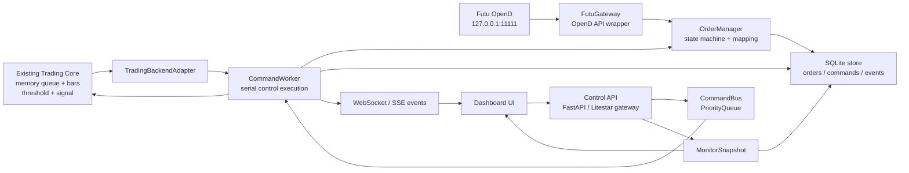
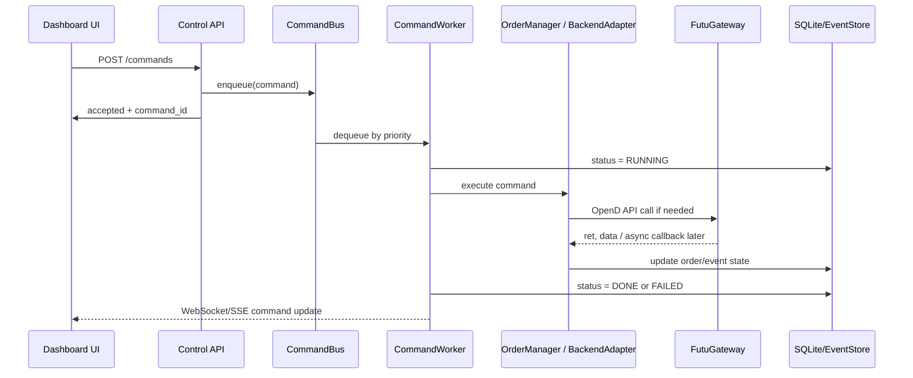
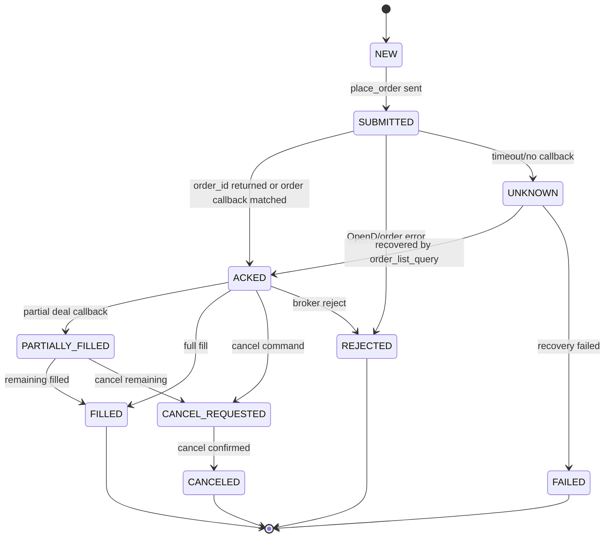

# OpenD 交易执行与控制监控层重构需求文档

面向 Codex / 工程实现者。目标不是继续修补旧 socket 网关代码，而是在保留交易计算层的基础上，重写 **OpenD 执行层、订单回报层、参数修改层、监控控制层**。

本文档已按 Futu OpenD Trade API 的实际 Python 接口整理。实现时只包含当前策略真正需要的接口；不把官方每个接口都暴露成 UI 按钮，也不生成重复、冗杂、无效的 condition check。

---

## 1. 总目标

当前系统中以下部分保留：

```text
tick memory queue
processed queue / bar aggregation
threshold calculation
signal generation
```

以下部分重构：

```text
OpenD connection
real order submission
cancel / modify order
order callback
deal callback
position / account / buying-power query
threshold parameter update
manual control command
monitoring snapshot
UI command feedback
```

OpenD 假设部署在同一台 Ubuntu 服务器上：

```python
OPEND_HOST = "127.0.0.1"
OPEND_PORT = 11111
```

交易对象主要是美股股票 / ETF，例如 `US.TQQQ`、`US.TSLL`。应使用证券交易上下文：

```python
OpenSecTradeContext(
    filter_trdmarket=TrdMarket.US,
    host="127.0.0.1",
    port=11111,
    security_firm=SecurityFirm.FUTUINC
)
```

如果实际账户属于富途证券而非 moomoo US，可把 `security_firm` 放到配置中，不要写死在逻辑层。

---

## 2. 总体架构



核心原则：

```text
UI 不直接下单。
API endpoint 不直接执行交易动作。
所有控制操作提交为 command。
CommandWorker 串行执行 command。
OrderManager 统一管理订单状态。
FutuGateway 是唯一允许直接调用 Futu OpenD Python API 的模块。
```

---

## 3. Command 生命周期



`Command DONE` 只表示“控制命令已被系统处理完成”。它不等于订单成交。订单是否成交由 `OrderManager` 根据订单回调、成交回调、查询结果维护。

---

## 4. 订单状态机



要求：

```text
每个订单必须有 client_order_id。
OpenD order_id 返回后必须绑定到 client_order_id。
订单回调可能早于 place_order 返回，因此必须支持 callback-first binding。
成交回调用 deal_id 去重，避免重复计入 position/PnL。
不要依赖 FIFO 猜测 ACK 归属。
不要保留旧的 ORD/CNL/ORDQ 字符串 socket 协议。
```

---

## 5. 代码风格与实现约束

### 5.1 简洁性要求

Codex 必须遵守：

```text
不要生成重复函数。
不要生成没有实际作用的 condition check。
不要到处 try/except 后吞掉错误。
不要为每个字段写冗余 isinstance 检查。
不要把官方每个接口都做成 UI button。
不要让 API endpoint 执行慢任务或交易动作。
不要在 callback 里做慢计算、UI 更新、磁盘大写入或下单。
不要在多个模块重复维护订单状态。
```

### 5.2 输入输出规范优先

为了减少无效 check，所有模块使用 Pydantic / dataclass 明确输入输出：

```text
CommandRequest -> CommandRecord
OrderIntent -> OrderRecord
BrokerOrderUpdate -> OrderEvent
BrokerDealUpdate -> DealEvent
ParameterPatch -> ValidatedStrategyParams
```

API 层只负责把外部输入转成标准模型。内部函数默认接收已经验证过的模型，不再重复检查每个字段。

### 5.3 错误处理要求

错误处理集中在边界层：

```text
API boundary: validate request and return rejected command.
FutuGateway boundary: translate ret != RET_OK into GatewayError.
CommandWorker boundary: catch command execution error and mark command FAILED.
Callback boundary: parse callback, if parse fails write ERROR event.
```

业务内部不要散落大量 `if x is None: return`。必要的 guard 只保留在交易安全相关位置，例如账户未解锁、OpenD 未连接、数量小于等于 0、超过最大可交易数量、RTH 限制、重复 command。

---

## 6. 推荐文件结构

```text
project/
  main.py
  config/
    settings.py
    symbols.yaml
    strategy_params.yaml

  trading_core/
    memory_queues.py
    bar_builder.py
    threshold_engine.py
    signal_engine.py
    strategy_state.py

  execution_layer/
    futu_gateway.py
    futu_api_reference.md
    order_models.py
    order_manager.py
    order_state_machine.py
    position_manager.py
    account_manager.py
    risk_guard.py
    execution_events.py

  control_layer/
    api.py
    command_models.py
    command_bus.py
    command_worker.py
    command_handlers.py
    backend_adapter.py
    monitor_snapshot.py
    websocket_manager.py

  storage/
    sqlite_store.py
    event_log.py
    param_store.py

  frontend/
    src/
      App.tsx
      api.ts
      ws.ts
      components/
        StatusBar.tsx
        CommandPanel.tsx
        OrdersTable.tsx
        PositionsTable.tsx
        ParamsPanel.tsx
        EventLog.tsx
```

---

## 7. Futu OpenD Python API：需要封装的函数

下面按当前系统需要程度分类。`Required` 必须实现；`Recovery/Audit` 可在第一版实现轻量版本；`Optional` 不要进入高频实时路径。

### 7.1 账户与交易初始化

#### 7.1.1 Required: `get_acc_list()`

官方用法：

```python
get_acc_list()
```

用途：启动时获取交易业务账户列表，确认目标账户 `acc_id`。其他交易接口调用前必须先确认账户无误。

返回：

```text
ret, data
ret == RET_OK: data is pd.DataFrame
ret != RET_OK: data is error string
```

关键返回字段：

```text
acc_id
trd_env
acc_type
uni_card_num
card_num
security_firm
sim_acc_type
trdmarket_auth
acc_status
acc_role
jp_acc_type
```

工程要求：

```text
必须优先使用 acc_id，不要依赖 acc_index。
启动时过滤出包含 TrdMarket.US 权限且 acc_status 可用的账户。
如果多个账户匹配，必须由配置指定 acc_id。
```

示例封装：

```python
class AccountManager:
    def load_accounts(self) -> pd.DataFrame:
        ret, data = self.trd_ctx.get_acc_list()
        if ret != RET_OK:
            raise GatewayError(f"get_acc_list failed: {data}")
        return data
```

#### 7.1.2 Required for live: `unlock_trade(...)`

官方用法：

```python
unlock_trade(password=None, password_md5=None, is_unlock=True)
```

参数：

```text
password: str | None
password_md5: str | None, 32 位小写 MD5
is_unlock: bool, True 解锁，False 锁定
```

规则：

```text
如果 password_md5 不为空，使用 password_md5。
否则使用 password 转 MD5。
解锁交易必须有密码；锁定交易忽略密码。
```

工程要求：

```text
密码或 password_md5 只能来自环境变量或安全配置文件。
不能写死在代码、日志、UI、数据库中。
解锁状态必须进入 health snapshot。
真实交易前必须确认 unlocked。
```

示例封装：

```python
def unlock_trade(self) -> None:
    ret, msg = self.trd_ctx.unlock_trade(
        password=None,
        password_md5=self.settings.trade_password_md5,
        is_unlock=True,
    )
    if ret != RET_OK:
        raise GatewayError(f"unlock_trade failed: {msg}")
```

---

### 7.2 资产、持仓、风控相关接口

#### 7.2.1 Required for monitor/risk: `accinfo_query(...)`

官方用法：

```python
accinfo_query(
    trd_env=TrdEnv.REAL,
    acc_id=0,
    acc_index=0,
    refresh_cache=False,
    currency=Currency.HKD,
    asset_category=AssetCategory.NONE,
)
```

用途：查询账户资产净值、现金、购买力、证券市值等。

关键参数：

```text
trd_env: TrdEnv
acc_id: int, 推荐使用
acc_index: int, 不推荐依赖
refresh_cache: bool, True 会向服务器请求最新数据并受限频影响
currency: Currency
asset_category: AssetCategory, 主要日本账户适用
```

关键返回字段：

```text
power
max_power_short
total_assets
securities_assets
cash
market_val
```

工程要求：

```text
用于 dashboard 和 risk snapshot，不放在每个 tick 或每个 bar 的实时路径。
默认 refresh_cache=False。
需要强制同步账户资金时才允许 refresh_cache=True。
```

#### 7.2.2 Required before manual/order sizing: `acctradinginfo_query(...)`

官方用法：

```python
acctradinginfo_query(
    order_type,
    code,
    price,
    order_id=None,
    adjust_limit=0,
    trd_env=TrdEnv.REAL,
    acc_id=0,
    acc_index=0,
    session=Session.NONE,
    jp_acc_type=SubAccType.JP_GENERAL,
    position_id=NONE,
)
```

用途：查询指定账户下某标的最大可买、可卖、可卖空、平仓需买回数量。

关键参数：

```text
order_type: OrderType
code: str, 例如 US.TQQQ
price: float
order_id: str | None, 用于查询指定订单最大可改数量；新单传 None
adjust_limit: float
trd_env: TrdEnv
acc_id: int
session: Session, 美股可用 RTH/ETH/OVERNIGHT/ALL
```

关键返回字段：

```text
max_cash_buy
max_cash_and_margin_buy
max_position_sell
max_sell_short
max_buy_back
long_required_im
```

工程要求：

```text
用于下单前风控或手动下单预检查。
不要在每个 tick 上调用。
如果用于改单最大数量查询，官方要求下单后至少间隔 0.5 秒再查。
```

#### 7.2.3 Required for monitor/recovery: `position_list_query(...)`

官方用法：

```python
position_list_query(
    code='',
    position_market=TrdMarket.NONE,
    pl_ratio_min=None,
    pl_ratio_max=None,
    trd_env=TrdEnv.REAL,
    acc_id=0,
    acc_index=0,
    refresh_cache=False,
    asset_category=AssetCategory.NONE,
    currency=Currency.USD,
)
```

用途：查询账户持仓列表，用于启动恢复、dashboard、flatten 前确认。

关键返回字段：

```text
position_side
code
stock_name
position_market
qty
can_sell_qty
currency
nominal_price
average_cost
diluted_cost
market_val
pl_ratio
pl_val
today_pl_val
unrealized_pl
realized_pl
position_id
```

工程要求：

```text
启动时查询一次，周期性低频刷新。
flatten_all 前必须读取最新持仓，可以 refresh_cache=True 但要控制频率。
内部 PositionManager 以此结果 reconcile 本地 position。
```

#### 7.2.4 Optional/Risk: `get_margin_ratio(code_list)`

官方用法：

```python
get_margin_ratio(code_list)
```

用途：查询股票融资融券数据。

参数：

```text
code_list: list[str]
每次最多 100 个标的
```

关键返回字段：

```text
code
is_long_permit
is_short_permit
short_pool_remain
short_fee_rate
alert_long_ratio
alert_short_ratio
im_long_ratio
im_short_ratio
mcm_long_ratio
mcm_short_ratio
mm_long_ratio
mm_short_ratio
```

工程要求：

```text
如果策略涉及 short / margin，RiskGuard 可在启动时和低频定时查询。
不用于高频实时路径。
```

#### 7.2.5 Optional/Audit: `get_acc_cash_flow(...)`

官方用法：

```python
get_acc_cash_flow(
    clearing_date='',
    trd_env=TrdEnv.REAL,
    acc_id=0,
    acc_index=0,
    cashflow_direction=CashFlowDirection.NONE,
    start='',
    end='',
)
```

用途：查询账户在指定日期的资金流水，覆盖出入金、调拨、货币兑换、买卖金融资产、融资融券利息等。

限制：

```text
同一 acc_id 每 30 秒最多 20 次。
资金流水按时间顺序排列。
模拟账户不支持。
```

工程要求：

```text
只用于 audit/report，不进入实时控制路径。
不要做 dashboard 高频刷新。
```

---

### 7.3 订单接口

#### 7.3.1 Required: `place_order(...)`

官方用法：

```python
place_order(
    price,
    qty,
    code,
    trd_side,
    order_type=OrderType.NORMAL,
    adjust_limit=0,
    trd_env=TrdEnv.REAL,
    acc_id=0,
    acc_index=0,
    remark=None,
    time_in_force=TimeInForce.DAY,
    fill_outside_rth=False,
    aux_price=None,
    trail_type=None,
    trail_value=None,
    trail_spread=None,
    session=Session.NONE,
    jp_acc_type=SubAccType.JP_GENERAL,
    position_id=NONE,
)
```

用途：提交订单。

关键参数：

```text
price: float, 市价单/竞价单也必须传，可以传任意值
qty: float, 股票股数；期权期货单位为张
code: str, 例如 US.TQQQ
trd_side: TrdSide.BUY / TrdSide.SELL
order_type: OrderType
adjust_limit: float, 价格微调幅度
trd_env: TrdEnv.REAL / TrdEnv.SIMULATE
acc_id: int, 推荐使用
remark: str | None, UTF-8 后最长 64 字节
time_in_force: TimeInForce, 默认 DAY
session: Session, 美股可用 RTH / ETH / OVERNIGHT / ALL
aux_price: stop / touch 类型订单触发价
trail_type, trail_value, trail_spread: trailing order 使用
```

关键返回字段：

```text
trd_side
order_type
order_status
order_id
code
stock_name
qty
price
create_time
updated_time
dealt_qty
dealt_avg_price
last_err_msg
remark
time_in_force
session
aux_price
trail_type
trail_value
trail_spread
```

重要异步规则：

```text
Python API 调用是同步的，但网络收发和回调是异步的。
订单回调或成交回调可能先于 place_order 返回。
OrderManager 必须支持 callback-first binding。
```

工程要求：

```text
所有 place_order 必须由 OrderManager 发起。
必须生成 client_order_id，并写入 remark 或本地映射。
不得从 FastAPI route 直接调用 place_order。
ret != RET_OK 必须抛出 GatewayError 或返回标准 BrokerError。
市价单仍传 price=0 或 last known price，但业务逻辑不得依赖该 price 成交。
```

#### 7.3.2 Required: `modify_order(...)`

官方用法：

```python
modify_order(
    modify_order_op,
    order_id,
    qty,
    price,
    adjust_limit=0,
    trd_env=TrdEnv.REAL,
    acc_id=0,
    acc_index=0,
    aux_price=None,
    trail_type=None,
    trail_value=None,
    trail_spread=None,
)
```

用途：改单、撤单、操作订单失效/生效、删除订单等。

撤单标准用法：

```python
modify_order(
    ModifyOrderOp.CANCEL,
    order_id,
    qty=0,
    price=0,
    trd_env=TrdEnv.REAL,
    acc_id=target_acc_id,
)
```

关键参数：

```text
modify_order_op: ModifyOrderOp
order_id: str
qty: float, 改单后的数量；撤单传 0
price: float, 改单后的价格；撤单传 0
adjust_limit: float
aux_price/trail_*: 条件单或 trailing order 改单使用
```

返回：

```text
ret, data
ret == RET_OK: data contains trd_env, order_id
ret != RET_OK: data is error string
```

工程要求：

```text
撤单必须通过 OrderManager.cancel_order。
改单和撤单 command 成功，只代表请求提交成功，不代表最终取消成功。
最终状态必须等 order callback 或 order_list_query recovery。
```

#### 7.3.3 Required for recovery: `order_list_query(...)`

官方用法：

```python
order_list_query(
    order_id="",
    order_market=TrdMarket.NONE,
    status_filter_list=[],
    code='',
    start='',
    end='',
    trd_env=TrdEnv.REAL,
    acc_id=0,
    acc_index=0,
    refresh_cache=False,
)
```

用途：查询未完成订单列表；也包含 24 小时内已成交或已撤订单。

关键参数：

```text
order_id: str, 指定订单过滤
order_market: TrdMarket
status_filter_list: list[OrderStatus]
code: str
start/end: str, YYYY-MM-DD HH:MM:SS 或 YYYY-MM-DD HH:MM:SS.MS
refresh_cache: bool
```

关键返回字段：

```text
trd_side
order_type
order_status
order_id
code
stock_name
order_market
qty
price
currency
create_time
updated_time
dealt_qty
dealt_avg_price
last_err_msg
remark
time_in_force
session
```

工程要求：

```text
用于启动恢复、unknown order recovery、dashboard 低频刷新。
不要高频全量轮询。
如果本地订单状态 UNKNOWN，可按 order_id 查询。
```

#### 7.3.4 Recovery/Audit: `history_order_list_query(...)`

官方用法：

```python
history_order_list_query(
    status_filter_list=[],
    code='',
    order_market=TrdMarket.NONE,
    start='',
    end='',
    trd_env=TrdEnv.REAL,
    acc_id=0,
    acc_index=0,
)
```

用途：查询历史订单列表。

时间规则：

```text
start 和 end 都为空：默认查询当前日期往前 90 天。
start 有值 end 为空：end 为 start 往后 90 天。
start 为空 end 有值：start 为 end 往前 90 天。
```

工程要求：

```text
用于启动后的历史 reconcile 或 audit，不进入实时路径。
如果需要回补订单历史，按日期窗口查询并写入 SQLite。
```

#### 7.3.5 Audit only: `order_fee_query(...)`

官方用法：

```python
order_fee_query(
    order_id_list=[],
    acc_id=0,
    acc_index=0,
    trd_env=TrdEnv.REAL,
)
```

用途：查询指定订单收费明细。

参数与限制：

```text
order_id_list: list[str], 每次最多 400 笔订单
同一 acc_id 每 30 秒内最多请求 10 次
仅支持查询 2018-01-01 之后的订单
模拟账户不支持
加拿大券商账户不支持
```

关键返回字段：

```text
order_id
fee_amount
fee_details
```

工程要求：

```text
只用于交易后成本核算或报表。
不要在实时成交回调里立即查询费用。
```

#### 7.3.6 Required: 订单回调 `TradeOrderHandlerBase.on_recv_rsp(...)`

官方用法：

```python
class TradeOrderHandler(TradeOrderHandlerBase):
    def on_recv_rsp(self, rsp_pb):
        ret, data = super(TradeOrderHandler, self).on_recv_rsp(rsp_pb)
        return ret, data
```

回调签名：

```python
on_recv_rsp(self, rsp_pb)
```

用途：异步接收 OpenD 推送的订单状态。

关键返回字段与 `order_list_query` 类似：

```text
trd_side
order_type
order_status
order_id
code
stock_name
qty
price
currency
create_time
updated_time
dealt_qty
dealt_avg_price
last_err_msg
remark
time_in_force
session
```

工程要求：

```text
handler 只解析 data 并写入 execution_event_queue。
handler 不直接修改 UI。
handler 不直接下单/撤单。
handler 不做慢计算。
OrderManager 消费事件并更新订单状态。
```

#### 7.3.7 Python-specific: 交易推送订阅 `sub_acc_push`

官方说明：

```text
Python 不需要订阅交易推送。
```

工程要求：

```text
Python 版本通过 trd_ctx.set_handler(TradeOrderHandler()) 和 trd_ctx.set_handler(TradeDealHandler()) 设置回调。
不要实现 Python 版 sub_acc_push 调用。
```

---

### 7.4 成交接口

#### 7.4.1 Required for live recovery: `deal_list_query(...)`

官方用法：

```python
deal_list_query(
    code="",
    deal_market=TrdMarket.NONE,
    trd_env=TrdEnv.REAL,
    acc_id=0,
    acc_index=0,
    refresh_cache=False,
)
```

用途：查询当日成交列表。

限制：

```text
只支持实盘交易，不支持模拟交易。
```

关键返回字段：

```text
trd_side
deal_id
order_id
code
stock_name
deal_market
qty
price
create_time
counter_broker_id
counter_broker_name
status
jp_acc_type
```

工程要求：

```text
用于启动恢复、callback missed recovery、dashboard 低频刷新。
deal_id 必须作为去重键。
```

#### 7.4.2 Audit/Recovery: `history_deal_list_query(...)`

官方用法：

```python
history_deal_list_query(
    code='',
    deal_market=TrdMarket.NONE,
    start='',
    end='',
    trd_env=TrdEnv.REAL,
    acc_id=0,
    acc_index=0,
)
```

用途：查询历史成交列表。

限制：

```text
只支持实盘交易，不支持模拟交易。
```

关键返回字段：

```text
trd_side
deal_id
order_id
code
stock_name
deal_market
qty
price
create_time
counter_broker_id
counter_broker_name
```

工程要求：

```text
用于历史 reconcile 和 audit，不进入实时路径。
```

#### 7.4.3 Required: 成交回调 `TradeDealHandlerBase.on_recv_rsp(...)`

官方用法：

```python
class TradeDealHandler(TradeDealHandlerBase):
    def on_recv_rsp(self, rsp_pb):
        ret, data = super(TradeDealHandler, self).on_recv_rsp(rsp_pb)
        return ret, data
```

回调签名：

```python
on_recv_rsp(self, rsp_pb)
```

用途：异步接收成交推送。该功能只支持实盘交易，不支持模拟交易。

工程要求：

```text
handler 只把成交 data 转成 DealEvent 并放入 execution_event_queue。
OrderManager/PositionManager 消费 DealEvent。
deal_id 必须去重。
成交回调不能直接修改 UI、不能直接下单。
```

---

## 8. FutuGateway 目标接口

```python
class FutuGateway:
    def connect(self) -> None: ...
    def close(self) -> None: ...
    def get_accounts(self) -> pd.DataFrame: ...
    def unlock(self) -> None: ...
    def get_account_info(self, refresh_cache: bool = False) -> pd.DataFrame: ...
    def get_positions(self, code: str = '', refresh_cache: bool = False) -> pd.DataFrame: ...
    def get_max_tradable_qty(self, order_type, code: str, price: float, session=Session.NONE) -> pd.DataFrame: ...
    def get_margin_ratio(self, code_list: list[str]) -> pd.DataFrame: ...
    def place_order(self, intent: OrderIntent) -> BrokerOrderResult: ...
    def cancel_order(self, broker_order_id: str) -> BrokerCancelResult: ...
    def query_open_orders(self, order_id: str = '', refresh_cache: bool = False) -> pd.DataFrame: ...
    def query_today_deals(self, code: str = '', refresh_cache: bool = False) -> pd.DataFrame: ...
    def query_history_orders(self, start: str, end: str, code: str = '') -> pd.DataFrame: ...
    def query_history_deals(self, start: str, end: str, code: str = '') -> pd.DataFrame: ...
    def query_order_fees(self, order_id_list: list[str]) -> pd.DataFrame: ...
```

`FutuGateway` 是唯一持有 `trd_ctx` 的对象。其他模块不得直接调用 `OpenSecTradeContext`。

---

## 9. Command 类型

```python
class CommandType(str, Enum):
    PAUSE_ENTRIES = "PAUSE_ENTRIES"
    RESTART_ENTRIES = "RESTART_ENTRIES"
    APPLY_THRESHOLD_PARAMS = "APPLY_THRESHOLD_PARAMS"
    FORCE_THRESHOLD_UPDATE = "FORCE_THRESHOLD_UPDATE"
    PLACE_ORDER = "PLACE_ORDER"
    CANCEL_ORDER = "CANCEL_ORDER"
    CANCEL_ALL = "CANCEL_ALL"
    FLATTEN_SYMBOL = "FLATTEN_SYMBOL"
    FLATTEN_ALL = "FLATTEN_ALL"
    SWITCH_MODE = "SWITCH_MODE"
    RELOAD_PARAMS = "RELOAD_PARAMS"
    SAVE_PARAMS = "SAVE_PARAMS"
    REFRESH_ACCOUNT = "REFRESH_ACCOUNT"
    REFRESH_POSITIONS = "REFRESH_POSITIONS"
```

优先级：

```text
0  EMERGENCY / FLATTEN_ALL / CANCEL_ALL / PAUSE_ENTRIES
5  CANCEL_ORDER / FLATTEN_SYMBOL / SWITCH_MODE
10 PLACE_ORDER / APPLY_THRESHOLD_PARAMS / SAVE_PARAMS / RESTART_ENTRIES
20 REFRESH_ACCOUNT / REFRESH_POSITIONS / FORCE_THRESHOLD_UPDATE
30 EXPORT / AUDIT / ORDER_FEE_QUERY
```

---

## 10. 参数更新要求

所有 threshold 参数修改必须走 command：

```json
{
  "type": "APPLY_THRESHOLD_PARAMS",
  "payload": {
    "symbol": "US.TQQQ",
    "params": {
      "take_profit": 0.006,
      "stop_loss": 0.004,
      "lookback_blocks": 6,
      "block_size": 390
    }
  }
}
```

执行流程：

```text
validate ParameterPatch
acquire PARAM_LOCK
update in-memory params atomically
persist params to yaml/json/sqlite
emit PARAM_UPDATED event
mark command DONE
```

只允许在 `backend_adapter.apply_threshold_params()` 中修改核心参数对象。

---

## 11. Monitor Snapshot

`GET /snapshot` 返回轻量状态，不要构造巨大 JSON。

```python
{
    "server_time": "...",
    "opend_connected": True,
    "trade_unlocked": True,
    "command_worker_alive": True,
    "command_queue_size": 0,
    "latest_tick_time": "...",
    "latest_bar_time": "...",
    "entries_enabled": True,
    "runtime_mode": "paper/live",
    "active_orders_count": 2,
    "positions": [],
    "latest_signal": {},
    "current_thresholds": {},
    "recent_commands": [],
    "recent_events": []
}
```

页面加载时调用一次 `/snapshot`，之后通过 WebSocket/SSE 接收增量更新。

---

## 12. WebSocket / SSE 事件

需要推送：

```text
COMMAND_ACCEPTED
COMMAND_RUNNING
COMMAND_DONE
COMMAND_FAILED
ORDER_SUBMITTED
ORDER_ACKED
ORDER_PARTIALLY_FILLED
ORDER_FILLED
ORDER_CANCELED
ORDER_REJECTED
DEAL_RECEIVED
POSITION_UPDATED
PARAM_UPDATED
ENTRIES_PAUSED
ENTRIES_RESTARTED
OPEND_CONNECTED
OPEND_DISCONNECTED
ERROR
```

---

## 13. SQLite 表

```sql
CREATE TABLE commands (
    command_id TEXT PRIMARY KEY,
    type TEXT NOT NULL,
    status TEXT NOT NULL,
    priority INTEGER NOT NULL,
    payload_json TEXT NOT NULL,
    result_json TEXT,
    error TEXT,
    created_at TEXT NOT NULL,
    started_at TEXT,
    finished_at TEXT
);

CREATE TABLE orders (
    client_order_id TEXT PRIMARY KEY,
    broker_order_id TEXT,
    source_command_id TEXT,
    strategy_id TEXT,
    symbol TEXT NOT NULL,
    side TEXT NOT NULL,
    quantity REAL NOT NULL,
    order_type TEXT NOT NULL,
    limit_price REAL,
    status TEXT NOT NULL,
    filled_quantity REAL DEFAULT 0,
    avg_fill_price REAL,
    created_at TEXT NOT NULL,
    submitted_at TEXT,
    acked_at TEXT,
    filled_at TEXT,
    last_update_at TEXT,
    last_message TEXT
);

CREATE TABLE deals (
    deal_id TEXT PRIMARY KEY,
    broker_order_id TEXT NOT NULL,
    client_order_id TEXT,
    symbol TEXT NOT NULL,
    side TEXT NOT NULL,
    quantity REAL NOT NULL,
    price REAL NOT NULL,
    create_time TEXT,
    received_at TEXT NOT NULL
);

CREATE TABLE events (
    id INTEGER PRIMARY KEY AUTOINCREMENT,
    ts TEXT NOT NULL,
    level TEXT NOT NULL,
    source TEXT NOT NULL,
    event_type TEXT NOT NULL,
    payload_json TEXT NOT NULL
);
```

---

## 14. Frontend 行为要求

前端点击按钮后：

```text
POST /commands
立即显示 command_id
显示 QUEUED
通过 WebSocket/SSE 更新 RUNNING / DONE / FAILED
```

禁止：

```text
点击按钮后等待 endpoint 真正执行完。
点击按钮后立即全量 refresh /api/state。
每秒全量拉取 dashboard state。
```

---

## 15. 迁移阶段

### Phase 1: FutuGateway + mock tests

实现 OpenD 连接、账户查询、解锁、place/cancel/query 的最小封装。先不要接 UI。

### Phase 2: OrderManager

实现 client_order_id、broker_order_id、callback-first binding、deal_id 去重、order state machine。

### Phase 3: Command Layer

实现 `POST /commands`、CommandBus、CommandWorker、CommandStatus。

### Phase 4: 参数修改与监控

实现 `APPLY_THRESHOLD_PARAMS`、`PAUSE_ENTRIES`、`RESTART_ENTRIES`、`REFRESH_POSITIONS`、`/snapshot`。

### Phase 5: UI

重写 dashboard 为 command/status 驱动，不再依赖全量 state polling。

---

## 16. 给 Codex 的最终指令

```text
Refactor the control and execution layer of the trading system.
Keep the existing in-memory market data queue, bar aggregation, threshold calculation, and signal generation logic.
Replace the old third-party socket gateway with Futu OpenD Python API.
Implement FutuGateway, OrderManager, CommandBus, CommandWorker, AccountManager, PositionManager, and MonitorSnapshot.
FastAPI/Litestar must only accept commands and expose monitoring endpoints; route handlers must not directly execute trading actions.
Each command must have command_id and lifecycle status.
Each order must have client_order_id and broker_order_id mapping.
Support callback-first order binding because Futu order/deal callbacks may arrive before place_order returns.
Use concise code with typed input/output models. Avoid duplicated functions, redundant condition checks, scattered try/except blocks, and useless defensive checks.
```
